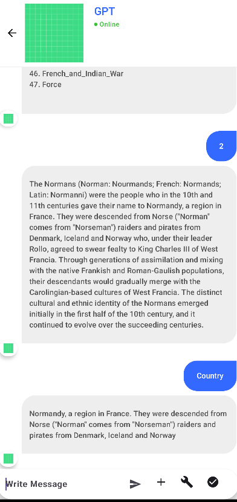
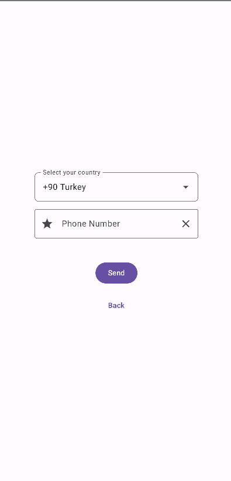
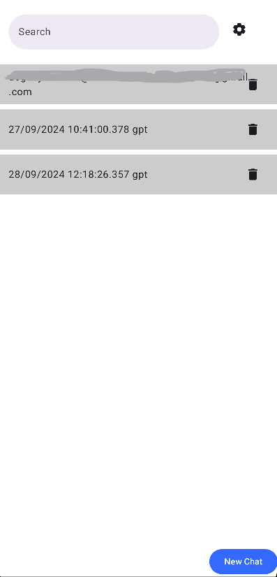
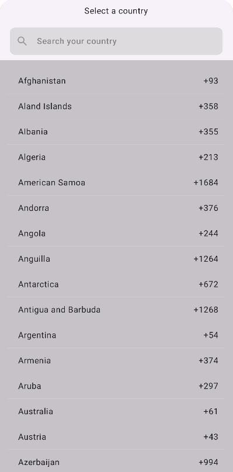
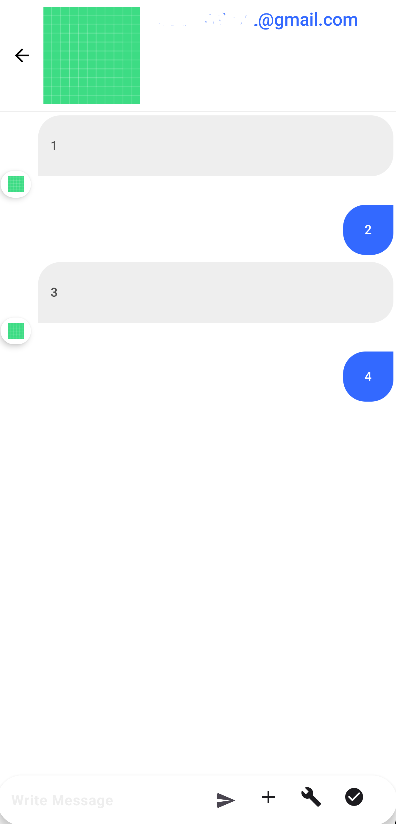
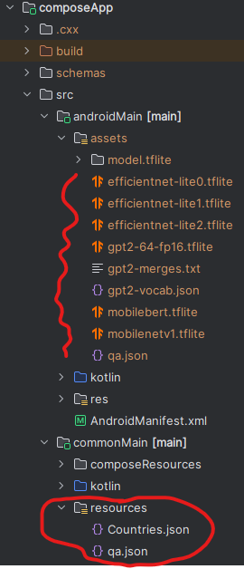

[TR] Yapay zeka ve arkadaşlarınızla konuşabileceğiniz bir uygulama. Sesten yazıya, görüntü ve mesaj olarak mesajlaşabilirsiniz. Telefon ve mail doğrulama yapılması gerekmektedir.   

[EN] An app where you can message with artificial intelligence and friends. You can exchange voice-to-text, image and text messages. Phone and mail verification is required.   

| Chat with AI            | Phone Auth.          |
| ----------------------- | -------------------- |
|  |   |

| Localization            | AI and Users Chat |
| ----------------------- | -------------------- |
|  |  |

| Phone Area Codes        | Users Chat |
| ----------------------- | ----------------------- |
|  |  |

| Resources               |                         |
| ----------------------- | ----------------------- |
|  |                         |

This is a Kotlin Multiplatform project targeting Android, Desktop.

* `/composeApp` is for code that will be shared across your Compose Multiplatform applications.
  It contains several subfolders:
    - `commonMain` is for code that’s common for all targets.
    - Other folders are for Kotlin code that will be compiled for only the platform indicated in the folder name.
      For example, if you want to use Apple’s CoreCrypto for the iOS part of your Kotlin app,
      `iosMain` would be the right folder for such calls.

Learn more about [Kotlin Multiplatform](https://www.jetbrains.com/help/kotlin-multiplatform-dev/get-started.html)…
